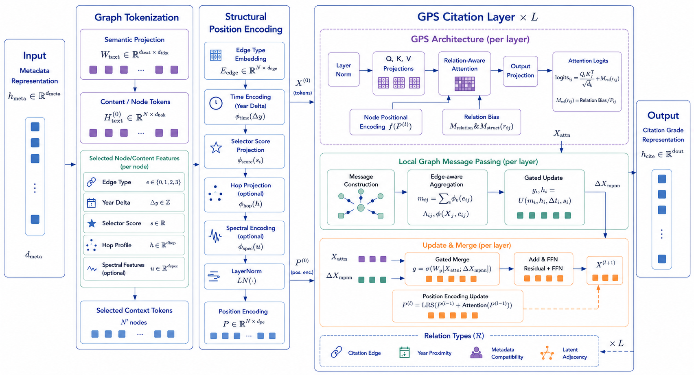
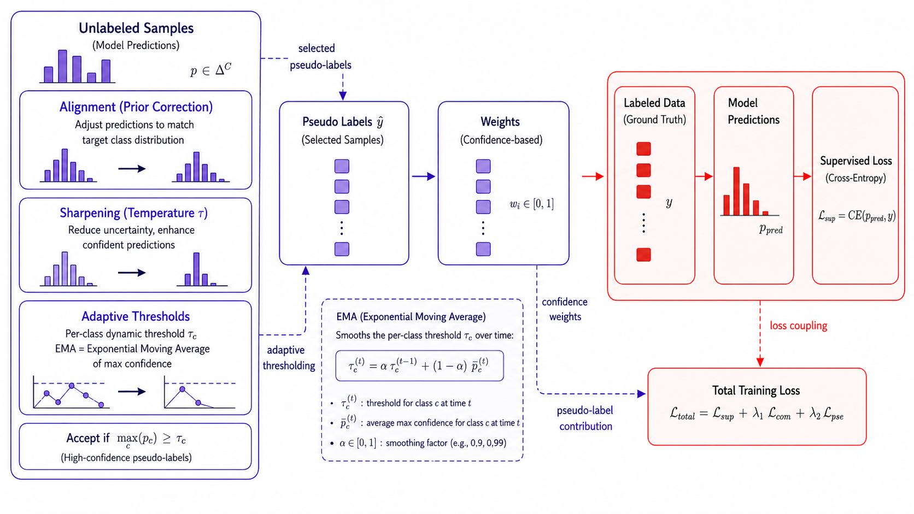
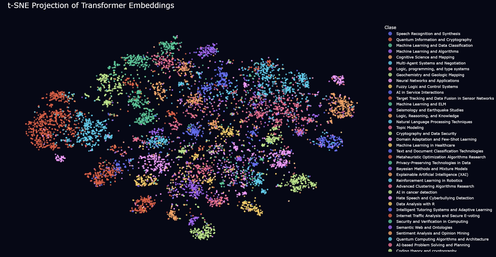

<div align="center">

# MetaGraphSci

### Multimodal Graph Self-Supervised Learning for Scientific Document Classification

**Text-aware, metadata-aware, and citation-aware classification of scientific papers under limited supervision.**

<p>
  
  
  
  
  
  
</p>
<p>
  
  
  
  
  
</p>

<p>
  <a href="#overview"><b>Overview</b></a> ·
  <a href="#architecture"><b>Architecture</b></a> ·
  <a href="#core-idea-in-formulas"><b>Formulas</b></a> ·
  <a href="#quickstart"><b>Quickstart</b></a> ·
  <a href="#configuration-profiles"><b>Configs</b></a> ·
  <a href="#docker-and-runpod"><b>Docker</b></a> ·
  <a href="#results"><b>Results</b></a> ·
  <a href="#documentation"><b>Docs</b></a>
</p>

</div>

---

## Overview

**MetaGraphSci** is a research codebase for scientific document classification under limited supervision. It combines three complementary evidence streams:

| Modality | Input | Representation |
|---|---|---|
| Text | title and abstract | SciBERT with optional LoRA or QLoRA adaptation |
| Metadata | venue, publisher, authors, year | embeddings plus Deep Cross Network interactions |
| Citation graph | citation neighbours and edge types | relation-aware citation transformer |

The goal is to learn a shared feature-graph space where textual semantics, bibliographic metadata, and citation structure reinforce each other. This is especially useful for long-tailed scientific taxonomies, where rare classes may have few labelled examples but remain close to related papers through citations and publication context.

---

## Architecture

<p align="center">
  
</p>

The model encodes each modality independently, projects all branches into a shared latent space, and combines them through gated residual fusion. The classifier compares the fused document embedding against learnable class prototypes using normalized cosine similarity.

<p align="center">
  
  
</p>

<p align="center">
  
</p>

### Pipeline stages

```text
raw corpora
  -> normalised documents.csv + citations.csv
  -> token, embedding, metadata, graph, and neighbour caches
  -> MultiScaleDocumentDataset
  -> MetaGraphSci training and evaluation
```

---

## Core idea in formulas

### Multimodal fusion

For a paper \(i\), the three encoders produce text, metadata, and citation representations:

$$
h_i^{t}=f_t(x_i^{title},x_i^{abstract}), \qquad
h_i^{m}=f_m(v_i,p_i,a_i,y_i), \qquad
h_i^{g}=f_g(i,\mathcal{N}_i,\mathcal{E}_i)
$$

The fused representation is a gated residual combination:

$$
z_i = \mathrm{normalize}\left(g_t \odot W_t h_i^t + g_m \odot W_m h_i^m + g_g \odot W_g h_i^g + r_i\right)
$$

### Citation-neighbour scoring

Neighbour candidates are ranked with a weighted structural score:

$$
s(i,j)=\lambda_d d(j)+\lambda_y e^{-|y_i-y_j|/\tau}+\lambda_r r(i,j)+\lambda_o J(\mathcal{N}_i,\mathcal{N}_j)
$$

where degree, temporal proximity, reciprocity, and one-hop overlap determine which citation contexts are selected.

### Prototype classifier

The classifier uses cosine-normalised class prototypes:

$$
\ell_{i,c}=\alpha \cdot \frac{z_i^{\top}p_c}{\lVert z_i\rVert_2\lVert p_c\rVert_2}
$$

### Semi-supervised objective

Training combines supervised classification, graph-aware contrastive learning, and confidence-filtered pseudo-labels:

$$
\mathcal{L}=\mathcal{L}_{sup}+\lambda_{ssl}\mathcal{L}_{graph}+\lambda_{pl}\mathcal{L}_{pseudo}
$$

<p align="center">
  
</p>

---

## Quickstart

### 1. Create the environment

```bash
python -m venv .venv
source .venv/bin/activate
pip install --upgrade pip
pip install -r requirements.txt
```

For CUDA-heavy runs:

```bash
export PYTORCH_CUDA_ALLOC_CONF=expandable_segments:True
```

### 2. Expected data layout

```text
data/
  openalex_ai/
    documents.parquet
    citations.parquet
    baselines.parquet
  openalex_ai_holdout100/
    documents.parquet
    citations.parquet
configs/
  openalex_ai_rtx5090_fast_stable.yaml
  openalex_ai_rtx6000_ada_fast_stable.yaml
Dockerfile
runs/
cache/
images/
```

### 3. Run a sanity baseline

```bash
python -u scripts/train.py \
  --config configs/openalex_ai_rtx5090_mid_1seed.yaml \
  --ablation text_only \
  --seed 42 \
  --device cuda
```

### 4. Run the full model

```bash
python -u scripts/train.py \
  --config configs/openalex_ai_rtx5090_mid_1seed.yaml \
  --ablation full \
  --seed 42 \
  --device cuda
```

---

## Configuration profiles

The repository is driven by YAML experiment profiles stored in `configs/`. A profile defines the benchmark, cache paths, dataset files, graph construction parameters, encoder dimensions, LoRA settings, ablations, optimizer settings, and pseudo-label schedule.

Recommended profiles:

| Config | Target hardware | Main use | Notes |
|---|---|---|---|
| `configs/openalex_ai_rtx5090_fast_stable.yaml` | local RTX 5090 class GPU | fast reproducible OpenAlex-AI run | `batch_size=48`, `num_workers=8`, `max_seq_length=192`, `max_context_size=6` |
| `configs/openalex_ai_rtx6000_ada_fast_stable.yaml` | RunPod RTX 6000 Ada pod | cloud training | same model settings, `num_workers=6` for safer pod I/O |

Both profiles use the same core setup: time-based splits, transductive citation graph mode, SciBERT tokenization, LoRA adaptation, gradient checkpointing, gated multimodal fusion, and the `text_only` plus `full` ablations.

Minimal profile structure:

```yaml
project:
  benchmark: openalex_ai
  run_name: MetaGraphSci_openalex_ai_rtx5090_fast_stable
  output_dir: runs/openalex_ai_rtx5090_fast_stable
  cache_dir: cache/openalex_ai

data:
  documents: data/openalex_ai/documents.parquet
  citations: data/openalex_ai/citations.parquet
  baselines: data/openalex_ai/baselines.parquet
  split_strategy: time
  graph_mode: transductive
  max_context_size: 6
  max_seq_length: 192

model:
  tokenizer_name: allenai/scibert_scivocab_uncased
  peft_mode: lora
  lora_r: 8
  lora_alpha: 16
  gradient_checkpointing: true
  freeze_backbone_until_layer: 6
  fusion_dim: 512
  use_latent_graph: true

train:
  batch_size: 48
  pretrain_epochs: 2
  finetune_epochs: 12
  seeds: [42]
  ablations: [text_only, full]

trainer:
  mixed_precision: bf16
  selection_metric: macro_f1
  lambda_ssl_final: 0.25
```

> [!TIP]
> Keep `output_dir`, `cache_dir`, and `run_name` unique per hardware/profile. This avoids overwriting checkpoints or mixing cache metadata between local and RunPod runs.

---

## Docker and RunPod

The project can be trained inside a RunPod-ready NVIDIA container. The Docker image uses the official PyTorch runtime with CUDA 12.4 and cuDNN 9, installs the non-Torch dependencies from `requirements.txt`, installs the repository in editable mode, and starts `scripts/train_nvidia.sh` by default.

```dockerfile
FROM pytorch/pytorch:2.4.1-cuda12.4-cudnn9-runtime

ENV DEBIAN_FRONTEND=noninteractive \
    PYTHONDONTWRITEBYTECODE=1 \
    PYTHONUNBUFFERED=1 \
    PIP_NO_CACHE_DIR=1 \
    HF_HOME=/workspace/.cache/huggingface \
    TRANSFORMERS_CACHE=/workspace/.cache/huggingface \
    TORCH_HOME=/workspace/.cache/torch \
    MLFLOW_TRACKING_URI=/workspace/mlruns

RUN apt-get update && apt-get install -y --no-install-recommends \
        git curl ca-certificates build-essential \
    && rm -rf /var/lib/apt/lists/*

WORKDIR /workspace/metagraphsci

COPY requirements.txt ./requirements.txt
RUN sed -i '/^torch$/d;/^torchvision$/d' requirements.txt && \
    pip install --upgrade pip && \
    pip install -r requirements.txt

COPY . .
RUN pip install -e .

CMD ["bash", "scripts/train_nvidia.sh"]
```

Build locally:

```bash
docker build -t metagraphsci:cuda12.4 .
```

Run with a mounted workspace/cache:

```bash
docker run --gpus all --rm -it \
  -v "$PWD/data:/workspace/metagraphsci/data" \
  -v "$PWD/runs:/workspace/metagraphsci/runs" \
  -v "$PWD/cache:/workspace/metagraphsci/cache" \
  metagraphsci:cuda12.4
```

Override the default command for a specific config:

```bash
docker run --gpus all --rm -it metagraphsci:cuda12.4 \
  bash -lc "python -u scripts/train.py \
    --config configs/openalex_ai_rtx6000_ada_fast_stable.yaml \
    --ablation full --seed 42 --device cuda"
```

For RunPod, use the same image and set the container start command to:

```bash
bash scripts/train_nvidia.sh
```

or run a specific cloud profile:

```bash
python -u scripts/train.py \
  --config configs/openalex_ai_rtx6000_ada_fast_stable.yaml \
  --ablation full \
  --seed 42 \
  --device cuda
```

---

## Reproducibility settings

| Symbol | Meaning | Fast | Mid |
|---|---:|---:|---:|
| \(E_{MCNA}\) | contrastive neighbour pretraining epochs | 2 | 3 |
| \(E_{CAPL}\) | supervised and pseudo-label fine-tuning epochs | 12 | 20 |
| \(E_{total}\) | total optimization budget | 14 | 23 |
| \(B\) | mini-batch size | 48 | 32 |
| \(K_{ctx}\) | citation-context neighbours per paper | 6 | 8 |
| \(L_{max}\) | maximum title-abstract token length | 192 | 256 |
| \(k_{sel}\) | selected citation neighbours | 4 | 6 |
| \(k_{lat}\) | latent graph edges per node | 2 | 3 |
| \(s\) | random seed | 42 | 42 |

---

## Training and evaluation

The supported ablation modes are:

| Ablation | Text | Metadata | Citation | Purpose |
|---|---:|---:|---:|---|
| `text_only` | yes | no | no | text baseline |
| `text_metadata` | yes | yes | no | metadata contribution |
| `text_citation` | yes | no | yes | graph contribution |
| `full` | yes | yes | yes | complete model |

Evaluate a holdout split in detached mode:

```bash
pkill -f "scripts/eval_holdout.py" 2>/dev/null
mkdir -p runs
rm -f runs/eval_holdout.log

PYTORCH_CUDA_ALLOC_CONF=expandable_segments:True \
nohup bash -c '
  source .venv/bin/activate
  python -u scripts/eval_holdout.py \
      --config configs/openalex_ai_rtx5090_mid_1seed.yaml \
      --holdout-dir data/openalex_ai_holdout100 \
      --ablation full --seed 42 --device cuda
' > runs/eval_holdout.log 2>&1 &

tail -f runs/eval_holdout.log
```

---

## Results

| Config | Ablation | Accuracy | Micro-F1 | Macro-F1 | Macro-F1 supported | Balanced accuracy | MCC |
|---|---|---:|---:|---:|---:|---:|---:|
| Fast | `text_only` | 0.6863 | 0.6863 | 0.4301 | 0.4190 | 0.4346 | 0.6761 |
| Fast | `full` | 0.6962 | 0.6962 | 0.4550 | 0.4432 | 0.4589 | 0.6866 |
| Mid | `text_only` | 0.7467 | 0.7467 | 0.5388 | 0.5248 | 0.5330 | 0.7385 |
| Mid | `text_metadata` | 0.7457 | 0.7457 | 0.5374 | 0.5234 | 0.5314 | 0.7375 |
| Mid | `full` | **0.7738** | **0.7738** | **0.5750** | **0.5601** | **0.5671** | **0.7666** |

The mid full model improves over fast full by **+0.0777 accuracy** and **+0.1200 macro-F1**, suggesting that the larger configuration improves long-tail behaviour more strongly than overall accuracy.

<p align="center">
  
</p>

---

## Project structure

```text
configs/                 YAML experiment profiles for local and RunPod runs
Dockerfile               CUDA 12.4 / PyTorch 2.4.1 RunPod-ready image
docs/base/                    extended documentation pages
scripts/                 training, evaluation, preprocessing, utilities
src/                     model, losses, data, trainer implementation
data/                    OpenAlex-AI data and holdout sets
images/                  architecture and result figures
runs/                    checkpoints, logs, metrics, predictions
cache/                   deterministic preprocessing caches
README.md                project landing page
references.bib           paper and presentation references
```

---

## Documentation

| Page | Description |
|---|---|
| [Overview](docs/base/01-overview.md) | what the pipeline produces and why the cache design matters |
| [Architecture](docs/base/02-architecture.md) | layered implementation view and modality formulas |
| [Quickstart](docs/base/03-quickstart.md) | local setup, dataset download, cache build, smoke test |
| [Datasets](docs/base/04-datasets.md) | Cora, PubMed, OGBN-Arxiv, FoRC, and OpenAlex support |
| [Cache layer](docs/base/05-cache-layer.md) | tokenization, embedding, encoder, graph, and neighbour caches |
| [Experiments](docs/base/06-experiments.md) | ablation order, metrics, plots, evaluation bundles |
| [Inspection](docs/base/07-model-inspection.md) | model debugging and pseudo-label checks |
| [API](docs/base/08-public-module-api.md) | public classes and responsibilities |
| [Results](docs/base/09-results-and-artifacts.md) | expected metrics, plots, predictions, and run context |
| [Configuration](docs/base/10-configuration.md) | YAML profiles, hardware-specific settings, and consistency checks |
| [Troubleshooting](docs/base/11-troubleshooting.md) | common runtime, shape, and numerical issues |
| [Roadmap](docs/base/12-roadmap.md) | next implementation tasks |

---

<div align="center">

**Reproducible multimodal classification with text, metadata, and citation context.**

</div>
