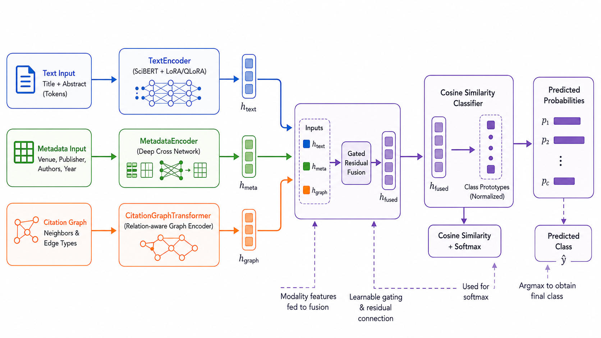

# Overview and what the pipeline produces

[Index](./00-index.md) · [Next](./02-architecture.md)

---

## Overview

MetaGraphSci is a citation-aware scientific document classification pipeline. It turns raw academic corpora such as OpenAlex, OGBN-Arxiv, FoRC, Cora, and PubMed into a fixed-shape PyTorch dataset where each document is paired with a ranked citation neighbourhood.

Most graph-classification pipelines hide preprocessing in one large script and rebuild everything on every run. MetaGraphSci separates preprocessing into cacheable stages. A change to one abstract invalidates only that document's tokens and embeddings; a change to a citation edge invalidates only graph-dependent artifacts.

  

## What the pipeline builds

| Stage | Artifact | Purpose |
|---|---|---|
| Download | `documents.csv`, `citations.csv`, `config.yaml` | normalised dataset bundle |
| Tabular processing | encoded labels and splits | stable train/validation/test protocol |
| Tokenization | `tokens.pt` | per-document input IDs and attention masks |
| Embeddings | `embeddings.pt` | frozen text vectors for fast experimentation |
| Metadata encoders | `encoders.json` | venue, publisher, and author vocabularies |
| Graph cache | `graph.pt` | citation edge index and split-specific views |
| Neighbour cache | `neighbors.json` | ranked context records for each center document |
| Dataset wrapper | `MultiScaleDocumentDataset` | ready-to-batch tensors for training |

## Design principle

Each cache is a content-addressed function of the data that created it:

$$
\operatorname{cache}_k = F_k(\operatorname{fingerprint}(D), \operatorname{fingerprint}(E), \theta_k)
$$

where \(D\) is the document table, \(E\) is the citation edge set, and \(\theta_k\) contains cache-specific settings such as tokenizer name, sequence length, graph mode, or context size.

## Recommended first pass

1. Download `cora` first.
2. Inspect `documents.csv` and `citations.csv`.
3. Build token, embedding, encoder, graph, and neighbour caches.
4. Iterate a few `MultiScaleDocumentDataset` batches.
5. Move to OpenAlex or OGBN-Arxiv only after the small dataset works.

> [!NOTE]
> The pipeline is a preprocessing and dataset layer. It produces the structured inputs consumed by downstream MetaGraphSci training scripts.

---

[Index](./00-index.md) · [Next](./02-architecture.md)
