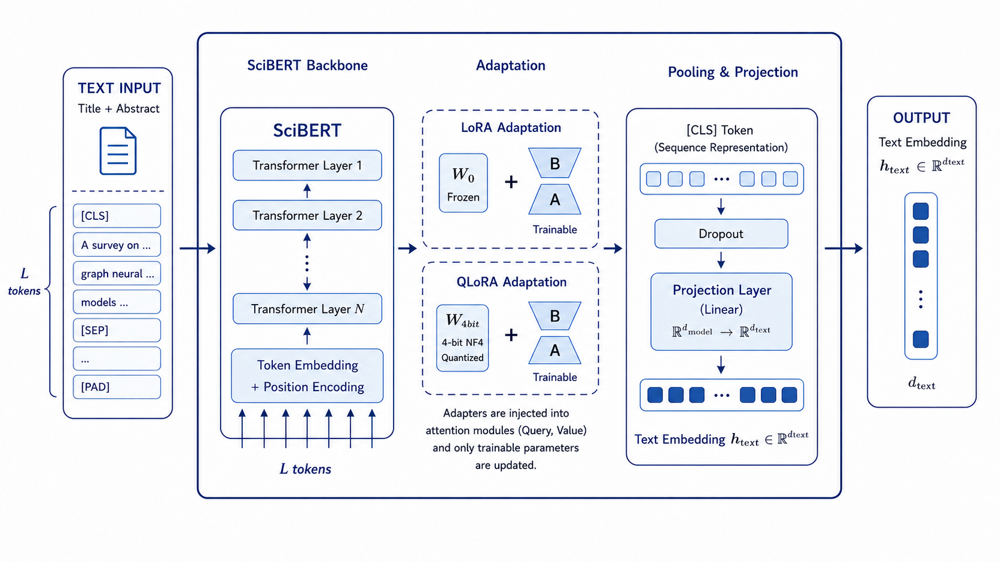
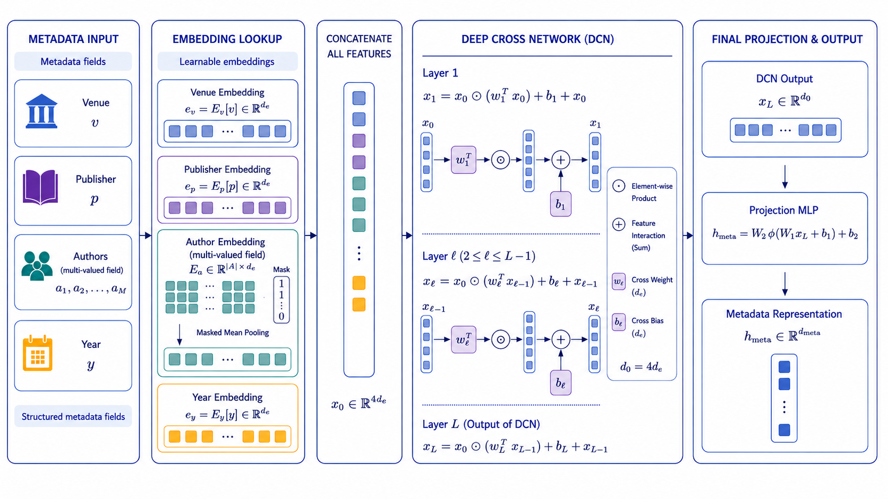

# Architecture, layers, and formulas

[Previous](./01-overview.md) · [Index](./00-index.md) · [Next](./03-quickstart.md)

---

## Layered architecture

The implementation is split so that each failure can be traced to a specific layer: labels, citation edges, graph mode, neighbour scoring, tokenizer, frozen encoder, dataset wrapper, or model fusion.

```text
raw corpora
  -> downloaders and schema normalisation
  -> tabular loading, label encoding, and splits
  -> cache layer
  -> MultiScaleDocumentDataset
  -> MetaGraphSci training loop
```

<p align="center">
  
</p>

## Main components

| Component | Responsibility |
|---|---|
| `download.py` | CLI entry point for dataset acquisition. |
| `downloaders.py` | Source-specific fetch and normalisation. |
| `tabular_utils.py` | document loading, label encoding, train/val/test splits. |
| `cache_utils.py` | fingerprints, compatibility checks, sidecar metadata. |
| `tokenization_cache.py` | incremental token cache keyed by document content. |
| `embedding_cache.py` | frozen encoder vectors keyed by model and content. |
| `encoder_cache.py` | metadata vocabularies built from training documents. |
| `graph_cache.py` | citation graph and split-specific subgraphs. |
| `context_caching.py` | ranked neighbour records. |
| `dataset.py` | tensor assembly and DataLoader integration. |

## Modality encoders

For document \(i\), MetaGraphSci builds three representations:

$$
h_i^{t}=f_t(x_i^{title},x_i^{abstract}), \qquad
h_i^{m}=f_m(v_i,p_i,a_i,y_i), \qquad
h_i^{g}=f_g(i,\mathcal{N}_i,\mathcal{E}_i)
$$

<p align="center">
  
  
</p>

## Gated residual fusion

The fusion block combines projected modality vectors with learned gates:

$$
z_i = \operatorname{Norm}\left(g_t \odot W_t h_i^t + g_m \odot W_m h_i^m + g_g \odot W_g h_i^g + r_i\right)
$$

This keeps the representation stable when metadata or citation branches are ablated.

## Classifier head

Class logits are computed against learnable prototypes:

$$
\ell_{i,c}=\alpha \cdot \cos(z_i,p_c)
      = \alpha \cdot \frac{z_i^{\top}p_c}{\lVert z_i\rVert_2\lVert p_c\rVert_2}
$$

---

[Previous](./01-overview.md) · [Index](./00-index.md) · [Next](./03-quickstart.md)
